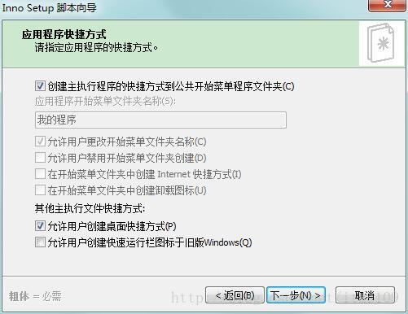
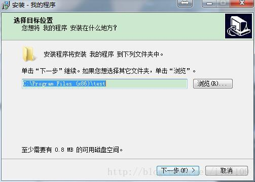

# Inno setup打包教程

如需转载请标明出处：http://blog.csdn.net/itas109
QQ技术交流群：12951803

## 下载地址

1.官方版本：http://www.jrsoftware.org/isdl.php
2.汉化版本：http://download.csdn.net/download/itas109/10158202
**2017-12-14 版本5.5.9**

**1.安装程序**
按照上述地址下载Inno Setup软件进行安装。这里以汉化版本为例程。
1

**2.制作打包脚本**


打开程序，点击文件，再点击新建。


点击下一步


这里要填写程序的名字，如"我的程序"，版本"1.5"’，应用程序的发布者，及应用程序的网站，后两者可以不写。点击下一步出现如下界面


可以修改安装文件夹名称，点击下一步，出现如下界面


这里首先要选择应用程序的可执行文件，也就是*.exe，点击右侧的浏览找到你的执行文件即可。下边的“允许用户在安装完成后启动应用程序”，勾选前面的对勾，即可，若禁止安装完成后就运行程序，可不选择此项。下边的“其他应用程序文件”比较重要，一般包含程序用到的一些DLL文件，配置文件（.ini文件）文件等，点击下一步，出现如下界面



勾选需要的功能，点击下一步出现如下界面


可以放一些提示信息，点击下一步，出现如下界面


选择语言，点击下一步，出现如下界面


可以配置setup文件的名称和输出目录等，点击下一步


点击下一步


点击完成

**3.编译脚本**


点击是


保存脚本，可以点击是


保存脚本到指定位置


setup文件输出到指定位置

**4.运行setup安装**




**5.程序运行**


**6.遇到问题**
(1).win7下不显示桌面快捷方式
原生成代码

```
[Tasks]
Name: "desktopicon"; Description: "{cm:CreateDesktopIcon}"; GroupDescription: "{cm:AdditionalIcons}"; Flags: unchecked; OnlyBelowVersion: 0,6.1
```

修改代码，删除OnlyBelowVersion: 0,6.1

```
[Tasks]
Name: "desktopicon"; Description: "{cm:CreateDesktopIcon}"; GroupDescription: "{cm:AdditionalIcons}"; Flags: unchecked; 
```

也可以直接默认选中创建桌面快捷方式

```
[Tasks]
Name: "desktopicon"; Description: "{cm:CreateDesktopIcon}"; GroupDescription: "{cm:AdditionalIcons}"; Flags: checkablealone; 
```


觉得文章对你有帮助，可以扫描二维码捐赠给博主，谢谢！

如需转载请标明出处：http://blog.csdn.net/itas109
QQ技术交流群：12951803

————————————————

版权声明：本文为CSDN博主「itas109」的原创文章，遵循CC 4.0 BY-SA版权协议，转载请附上原文出处链接及本声明。

原文链接：https://blog.csdn.net/itas109/article/details/78801199