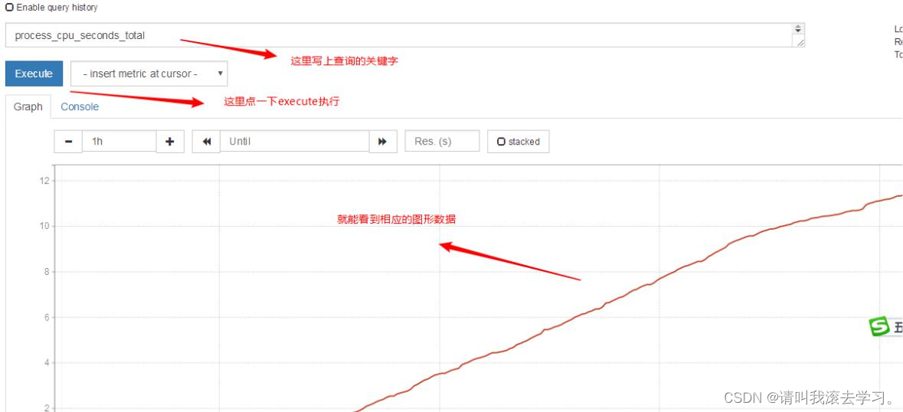

# Promethus(普罗米修斯）监控系统

Prometheus(由go语言(golang)开发)是一套开源的监控&报警&时间序列数据库的组合。适合监控docker容器。因为kubernetes(俗称k8s)的流行带动了prometheus的发展。

# **一、普罗米修斯概述**


Prometheus(由go语言(golang)开发)是一套开源的监控&报警&时间序列数据库的组合。适合监控docker容器。因为kubernetes(俗称k8s)的流行带动了prometheus的发展。

[Overview | Prometheus](https://prometheus.io/docs/introduction/overview/?login=from_csdn)

# **二、时间序列数据**


## 1、什么是序列数据


时间序列数据(TimeSeries Data) : 按照时间顺序记录系统、设备状态变化的数据被称为时序数据。

应用的场景很多, 如：

无人驾驶车辆运行中要记录的经度，纬度，速度，方向，旁边物体的距离等等。每时每刻都要将数据记录下来做分析。


某一个地区的各车辆的行驶轨迹数据

传统证券行业实时交易数据

实时运维监控数据等


## 2、时间序列数据特点


性能好

关系型数据库对于大规模数据的处理性能糟糕。NOSQL可以比较好的处理大规模数据，让依然比不上时间序列数据库。


存储成本低

高效的压缩算法，节省存储空间，有效降低IO

Prometheus有着非常高效的时间序列数据存储方法，每个采样数据仅仅占用3.5byte左右空间，上百万条时间序列，30秒间隔，保留60天，大概花了200多G（来自官方数据)

## 3、Prometheus的主要特征


多维度数据模型


灵活的查询语言


不依赖分布式存储，单个服务器节点是自主的


以HTTP方式，通过pull模型拉去时间序列数据


也可以通过中间网关支持push模型


通过服务发现或者静态配置，来发现目标服务对象


支持多种多样的图表和界面展示

## 4、普罗米修斯原理架构图

 


# 三、环境准备

 


1. 静态ip(要求能上外网)

1. 主机名

各自配置好主机名

hostnamectl set-hostname --static server.cluster.com

三台都互相绑定IP与主机名

vim /etc/hosts

10.1.1.13 server.cluster.com

10.1.1.14 agent1.cluster.com

10.1.1.15 grafana.cluster.com

1. 时间同步(时间同步一定要确认一下)
2. 关闭防火墙,selinux

- systemctl stop firewalld
- systemctl disable firewalld
- iptables -F


## 1、安装prometheus

以下软件包的百度网盘地址

链接：https://pan.baidu.com/s/1UfjFiZJXYx6AUr0HEcjaiA

提取码：vc2n

从 [https://prometheus.io/download/ ](https://prometheus.io/download/?login=from_csdn)下载相应版本，安装到服务器上官网提供的是二进制版，解压就能用，不需要编译

```gradle
[root@server ~]# tar xf prometheus-2.5.0.linux-amd64.tar.gz -C /usr/local/

[root@server ~]# mv /usr/local/prometheus-2.5.0.linux-amd64/ /usr/local/prometheus
```

直接使用默认配置文件启动

```gradle
[root@server ~]# /usr/local/prometheus/prometheus

--config.file="/usr/local/prometheus/prometheus.yml" &
```

确认端口(9090)

```autoit
[root@server ~]# lsof -i:9090
```

## 2、prometheus界面


通过浏览器访问http://服务器IP:9090就可以访问到prometheus的主界面

 

 默认只监控了本机一台，点Status --》点Targets --》可以看到只监控了本机

  
 ## 3、主机数据展示


通过http://服务器IP:9090/metrics可以查看到监控的数据 


在web主界面可以通过关键字查询监控项


## 4、监控远程Linux主机


① 在远程linux主机(被监控端agent1)上安装node_exporter组件

下载地址: [Download | Prometheus](https://prometheus.io/download/?login=from_csdn)

```gradle
[root@agent1 ~]# tar xf node_exporter-0.16.0.linux-amd64.tar.gz -C /usr/local/

[root@agent1 ~]# mv /usr/local/node_exporter-0.16.0.linux-amd64/ /usr/local/node_exporter
```

里面就一个启动命令node_exporter,可以直接使用此命令启动

```gradle
[root@agent1 ~]# ls /usr/local/node_exporter/

LICENSE node_exporter NOTICE

[root@agent1 ~]# nohup

/usr/local/node_exporter/node_exporter &
```

确认端口(9100)

```autoit
[root@agent1 ~]# lsof -i:9100
```

扩展: nohup命令: 如果把启动node_exporter的终端给关闭,那么进程也会随之关闭。nohup命令会帮你解决这个问题。

② 通过浏览器访问http://被监控端IP:9100/metrics就可以查看到node_exporter在被监控端收集的监控信息


③ 回到prometheus服务器的配置文件里添加被监控机器的配置段

在主配置文件最后加上下面三行

```1c
[root@server ~]# vim /usr/local/prometheus/prometheus.yml

- job_name: 'agent1' # 取一个job名称来代表被监控的机器

static_configs:

- targets: ['10.1.1.14:9100'] # 这里改成被监控机器的IP，后面端口接9100
```

改完配置文件后,重启服务

```autoit
[root@server ~]# pkill prometheus

[root@server ~]# lsof -i:9090 # 确认端口没有进程占用

[root@server ~]# /usr/local/prometheus/prometheus --config.file="/usr/local/prometheus/prometheus.yml" &

[root@server ~]# lsof -i:9090 # 确认端口被占用，说明重启成功
```

④ 回到web管理界面 --》点Status --》点Targets --》可以看到多了一台监控目标


## 5、监控远程MySQL


① 在被管理机agent1上安装mysqld_exporter组件

下载地址: [Download | Prometheus](https://prometheus.io/download/?login=from_csdn)

安装mysqld_exporter组件

```gradle
[root@agent1 ~]# tar xf mysqld_exporter-0.11.0.linux-amd64.tar.gz -C /usr/local/

[root@agent1~]# mv /usr/local/mysqld_exporter-0.11.0.linux-amd64/ /usr/local/mysqld_exporter

[root@agent1 ~]# ls /usr/local/mysqld_exporter/

LICENSE mysqld_exporter NOTICE
```

安装mariadb数据库,并授权(若已安装mysql数据库可以跳过)

```pgsql
[root@agent1 ~]# yum install mariadb\* -y

[root@agent1 ~]# systemctl restart mariadb

[root@agent1 ~]# systemctl enable mariadb

[root@agent1 ~]# mysql

MariaDB [(none)]> grant select,replication client,process ON *.* to 'mysql_monitor'@'localhost' identified by '123'; (注意:授权ip为localhost，因为不是prometheus服务器来直接找mariadb获取数据，而是prometheus服务器找mysql_exporter,mysql_exporter再找mariadb。所以这个localhost是指的mysql_exporter的IP)

MariaDB [(none)]> flush privileges;

MariaDB [(none)]> quit
```

创建一个mariadb配置文件，写上连接的用户名与密码(和上面的授权的用户名和密码要对应)

```gradle
[root@agent1 ~]# vim /usr/local/mysqld_exporter/.my.cnf

[client]

user=mysql_monitor

password=123

启动mysqld_exporter

[root@agent1 ~]#

nohup

/usr/local/mysqld_exporter/mysqld_exporter --config.my-cnf=/usr/local/mysqld_exporter/.my.cnf &
```

确认端口(9104)

```autoit
[root@agent1 ~]# lsof -i:9104
```

② 回到prometheus服务器的配置文件里添加被监控的mariadb的配置段

在主配置文件最后再加上下面三行

```1c
[root@server ~]# vim /usr/local/prometheus/prometheus.yml

- job_name: 'agent1_mariadb'

# 取一个job名称来代表被监控的mariadb

static_configs:

- targets: ['10.1.1.14:9104']

# 这里改成被监控机器的IP，后面端口接9104
```

改完配置文件后,重启服务

```ini
[root@server ~]# pkill prometheus

[root@server ~]# lsof -i:9090

[root@server ~]# /usr/local/prometheus/prometheus

--config.file="/usr/local/prometheus/prometheus.yml" &

[root@server ~]# lsof -i:9090
```

③ 回到web管理界面 --》点Status --》点Targets --》可以看到监控mariadb了


# **四、Grafana可视化图形工具**


## 1、什么是Grafana


Grafana是一个开源的度量分析和可视化工具，可以通过将采集的数据分析，查询，然后进行可视化的展示,并能实现报警。


网址: [Grafana: The open observability platform | Grafana Labs](https://grafana.com/?login=from_csdn)

## 2、使用Grafana连接Prometheus


① 在grafana服务器上安装grafana

下载地址:[Download Grafana | Grafana Labs](https://grafana.com/grafana/download?login=from_csdn)

我这里选择的rpm包，下载后直接rpm -ivh安装就OK

```autoit
[root@grafana ~]# rpm -ivh /root/Desktop/grafana-5.3.4-1.x86_64.rpm -y
```

启动服务

```autoit
[root@grafana ~]# systemctl start grafana-server

[root@grafana ~]# systemctl enable grafana-server
```

确认端口(3000)

```autoit
[root@grafana ~]# lsof -i:3000
```

② 通过浏览器访问 http:// grafana服务器IP:3000就到了登录界面,使用默认的admin用户,admin密码就可以登陆了


③ 下面我们把prometheus服务器收集的数据做为一个数据源添加到grafana,让grafana可以得到prometheus的数据。

 


④ 然后为添加好的数据源做图形显示

 


⑤ 保存


⑥ 最后在dashboard可以查看到


⑦ 匹配条件显示