# 丢掉你的电信IPTV机顶盒，在家的任何角落看IPTV直播

原帖地址：https://www.znds.com/tv-739214-1-1.html

最近家里装了100M的电信宽带，同时附带开通了电信IPTV，可以通过电信赠送的IPTV机顶盒收看电视直播。电信IPTV因为使用电信专线传送视频信号，具有信源稳定、码率高、清晰度高等特点，相比以往在安卓电视盒子上使用电视家、HDP等直播软件看直播效果好了太多。但也存在不足：一是只有一个IPTV盒子，安装在客厅后，睡房想看就必须得把盒子再移到睡房，非常的不方便；二是平时都会用小米盒子看点播，如果又想用IPTV盒子看直播还要切换电视信源，非常不方便。如果能将IPTV的视频源融入到小米盒子的电视家、HDP等直播软件内，通过打开这些APP就能看直接，那就方便太多。经过一番摸索，不但实现了在安卓盒子上看直接，而且可以在手机、iPad等设备上在家里的任何角落里观看。下面就要分享一下这次摸索的过程。

首先，要有一台同时具有无线、有线网卡的电脑，笔记本+USB转ARJ45口方式也行，其次，要有一台具有双WAN的无线路由器（本人有里用的是TP-LINK WVR1750L）。

第一步，获取电信IPTV各节目源的播放地址，这是后续所有操作的基础，没有播放地址，后续的一切都无从谈起。
电信IPTV配的盒子是创维的E900-S：

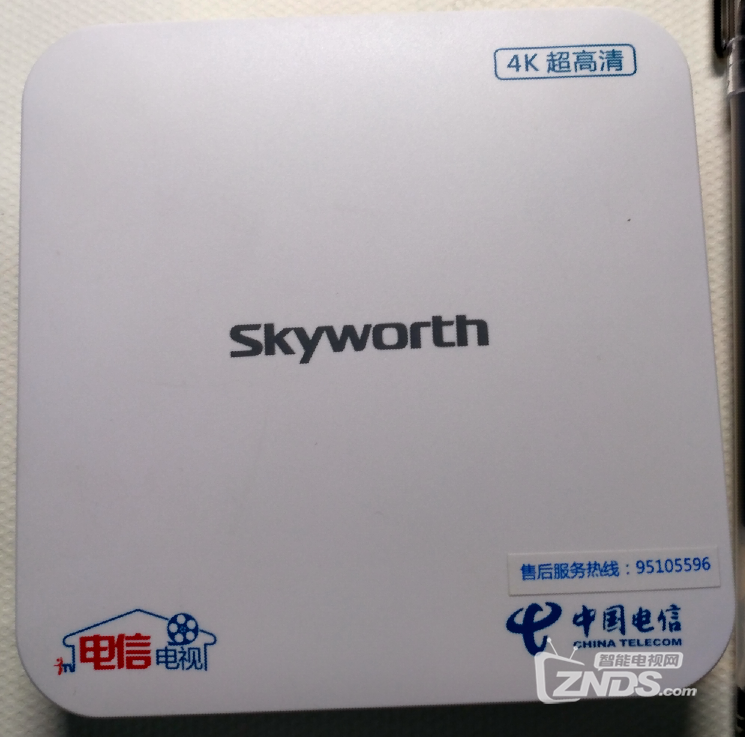
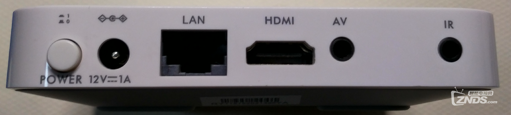
经研究，目前盒子工作方式是：盒子的LAN口和光猫的IPTV口连接，盒子进行一次PPPOE拨号，连接到电信的专用网络，盒子内置直播APP访问专网的指定地址实现节目观看。我们只要通过电脑抓取网络包，就有可能找到播放的网络地址。现在的连接方式我们不好抓包，最好是让观看的线路经过我们的电脑，这样抓包更直接有效。我的方法是将光猫IPTV口的网线连接到电脑的网口，由电脑PPPOE拨号连接到电信的专网，再用电脑的无线网卡进行WIFI共享，IPTV盒子通过WIFI连接到电脑进行直播播放，这时候在电脑上运行抓包软件，就能获取播放地址。首先在电脑上安装好WIFI共享软件和抓包软件，WIFI共享我用的是猎豹WIFI，抓包软件用的是Wireshark。

要实现电脑PPPOE拨号，首先要获取盒子里的拨号账号。盒子正常启动完成后，按盒子遥控器上的“设置”键打开设置界面，会要求输入密码，默认密码是123456。

进入设置后找到“基本设置－>有线连接设置”
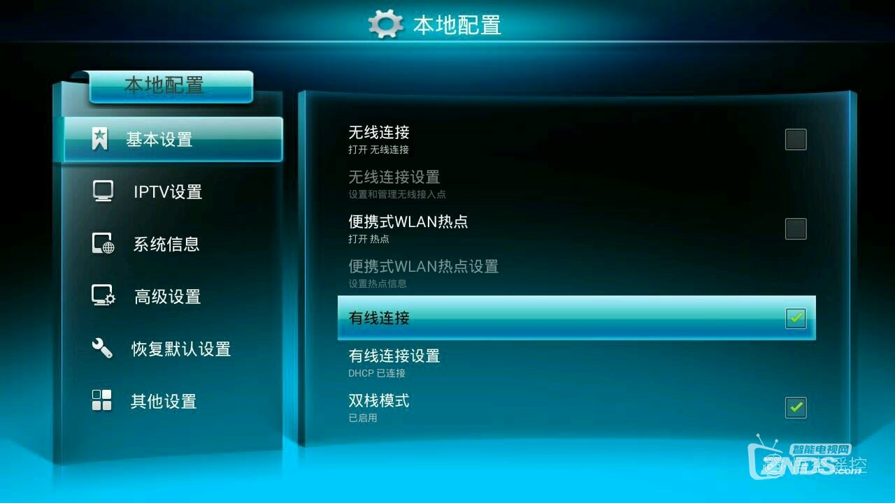
移动到使用PPPOE上确认：
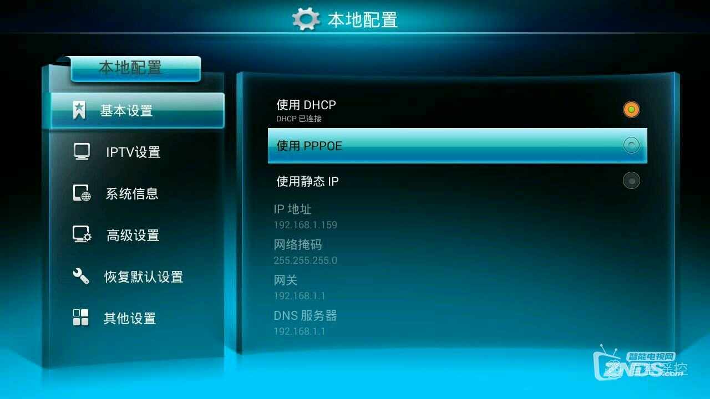
这时候会出现PPPOE的账号和密码，记录下来即可
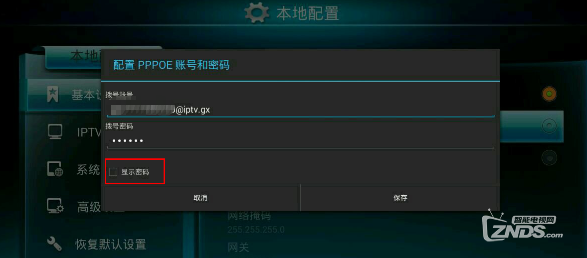
接下来，将网络的一头连接光猫IPTV口，一头连接到电脑的网口。在电脑上新建一个拨号连接：
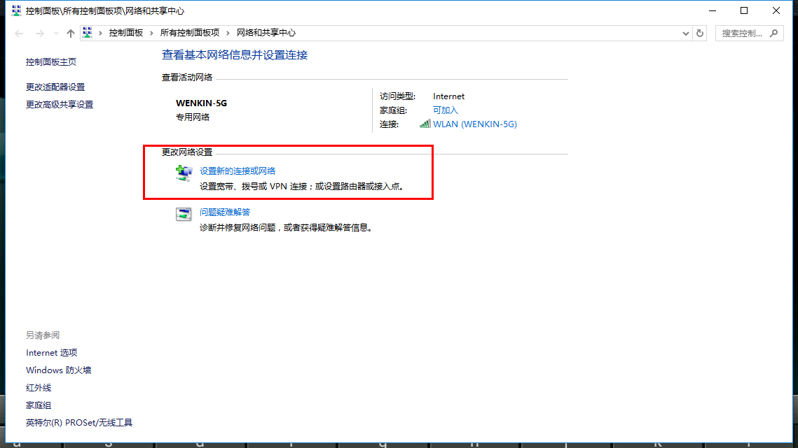
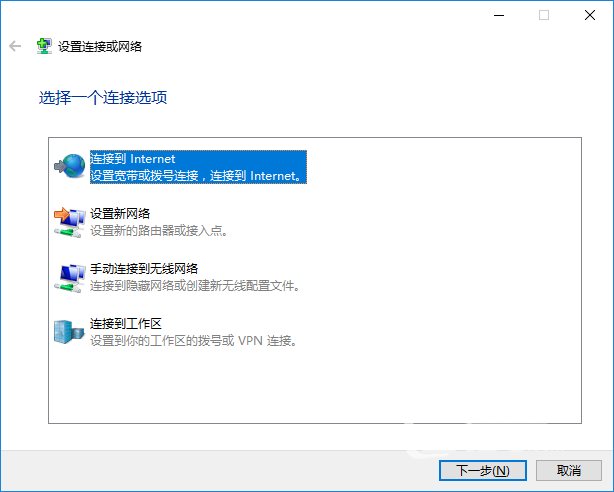
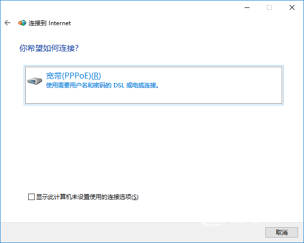
把IPTV机顶盒上获取的账号和密码输入，连接命名为IPTV：
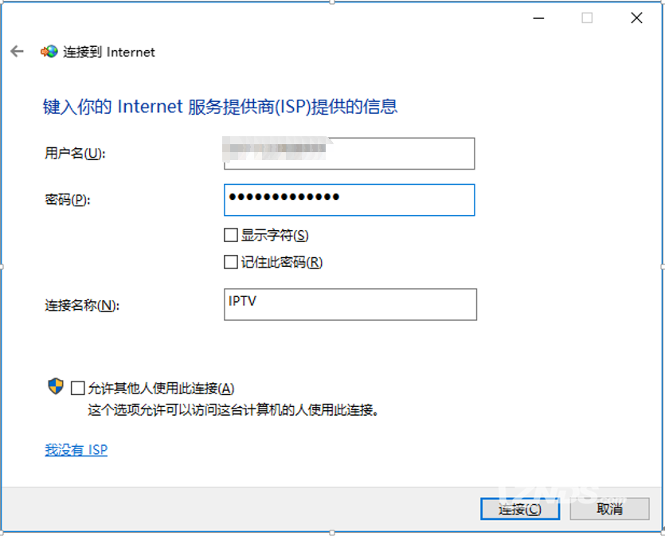
在电脑上进行拨号连接到电信专用网络：

启动猎豹WIFI进行WIFI共享。
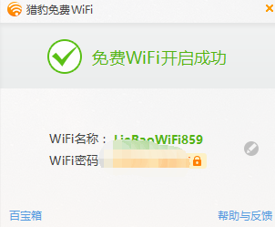
进入IPTV盒子的设置，在基本设置里将网络设置为无线连接，并确保让盒子连接到电脑上共享出来的WIFI上。
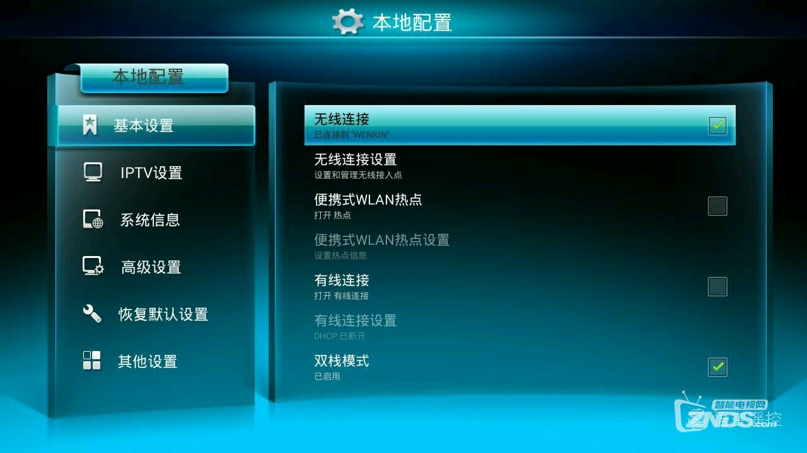
这时候返回到盒子的播放界面，应该已经可以正常收看直播了。
接下来，在电脑上找到猎豹WIFI共享的本地连接名称，这里是“本地连接*14”。
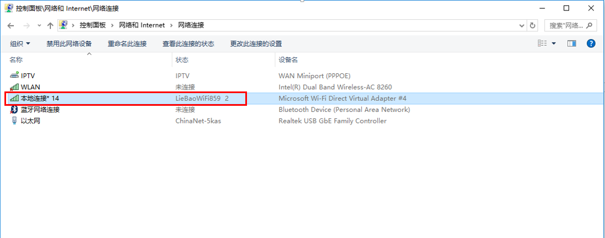
启动抓包软件Wireshark，在界面上双击刚才取到的本地连接名称“本地连接*14”，即可启动抓包。
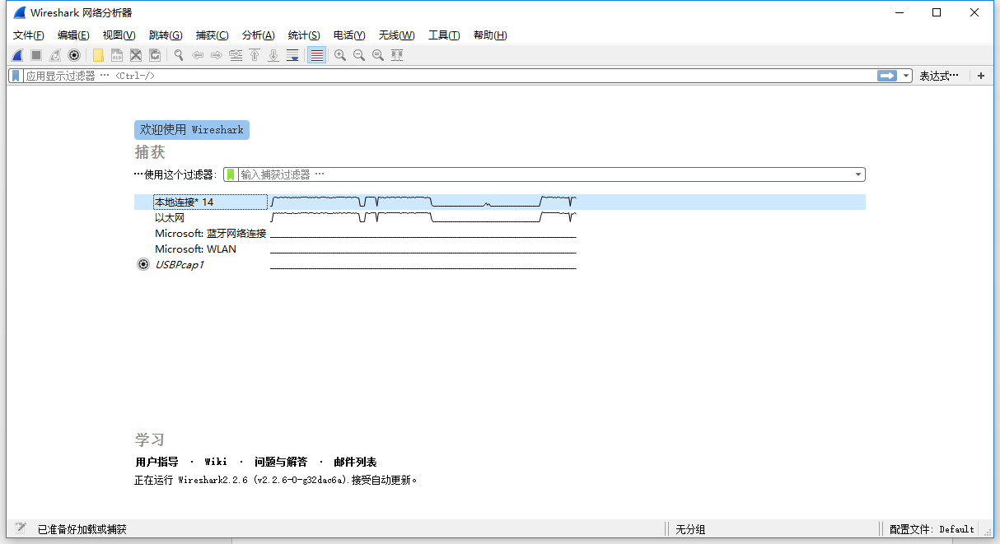
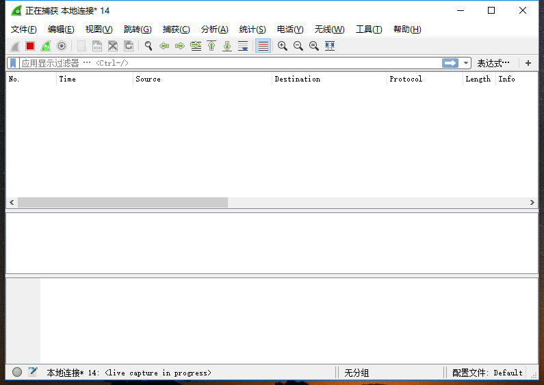
在IPTV盒子上换一个电视台，并在Wireshark中将抓取结果按Protocol进行排序（点击一下Protocol标题即可）。在排序的结果中找到RTSP协议，找到有“302 Moved Temporarily”的这一行，欢庆吧，这就是我们要找到流媒体的地址！
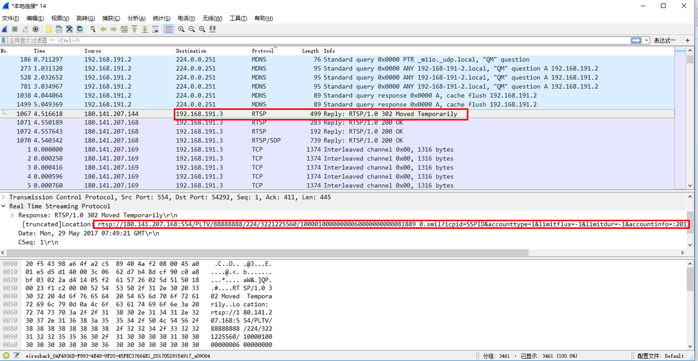
在地址上点鼠标右键，选择复制值即可。
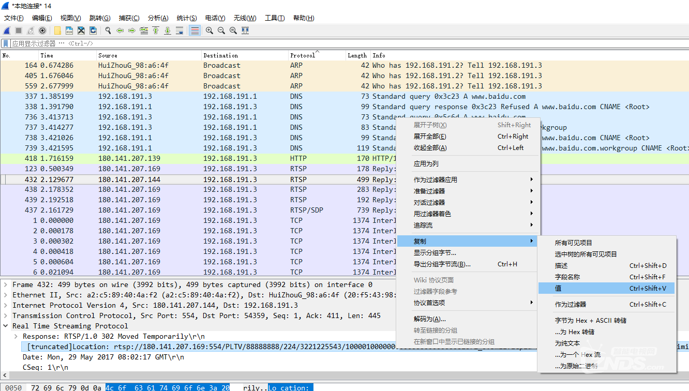
通过不断的换台，不断的复制粘贴，你就能取到所有电视台的播放地址了！
取到了地址，我们就取得了阶段性胜利，接下来就要看如何将地址放入到其他直接软件中并能让它顺利播放。由于直播服务器并不在互联网，所以那个PPPOE的拨号，并不能访问外网，而且，它的带宽只有10M，只够你看IPTV用。接下来双WAN口的路由器即可以派上用场了。路由器的WAN1口接光猫的LAN1口，用于互联网的正常访问，WAN2连接光猫IPTV口，用于IPTV的专网的访问。将你的上网账号和IPTV账号（就是我们在IPTV机顶盒里取到的PPPOE账号）分别配置到WAN1口和WAN2口（我家用的是WAN3）即可：
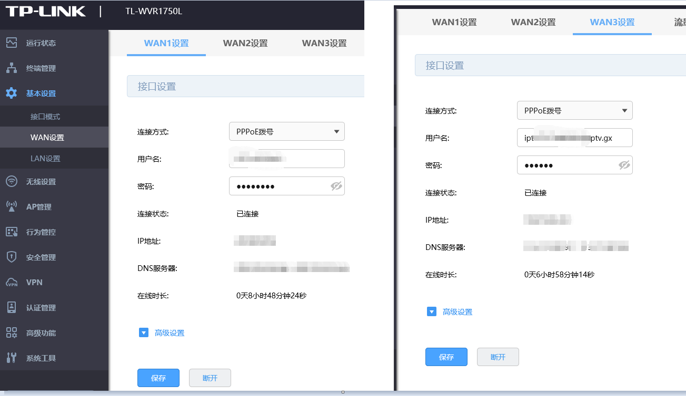
接下来，进行关键一步的设置，根据访问目的地址的不同，分别选择不同的出口。
这里建立了两条规则，一条是要访问目地地址是180.141.207.1-250（这是刚才抓包取到的各电视台对应的IP地址段）时，对应到出口WAN2，第二条规则是其他到任何地址的访问就到WAN1口。
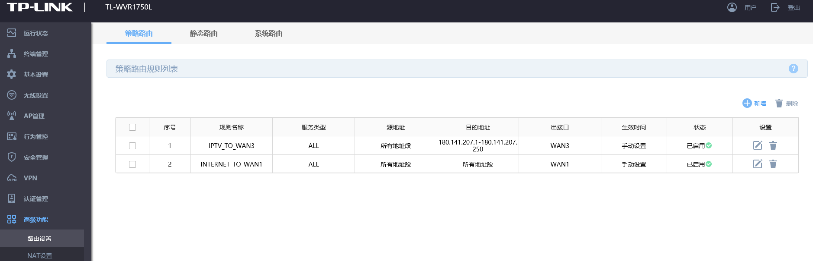
此时最重要的两步都已经完成。接下来只要把各电视台流媒体的播放地址放入电视家、HDP等软件中即可。这些软件支持的导入都是文本格式，内容为“电视台名称,网址”，一行一个电视台即可，文件要求必须存储为UTF-8格式：
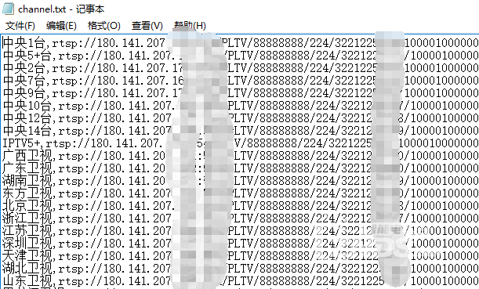
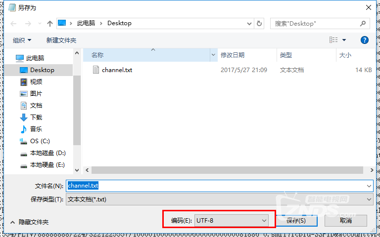
电视家要求的文件名为必须是channel.txt，HDP对文件名没有要求。将文件复制到U盘里，在电视家的播放过程中插入U盘，电视家即会提示是否导入自定义列表，选择导入即可。
HDP更方便一些，只要在播放过程中按返回键，就会有远程管理的提示：

此时只要在电脑浏览器中按要求输入网址，即可打开自定义播放列表的上传界面：
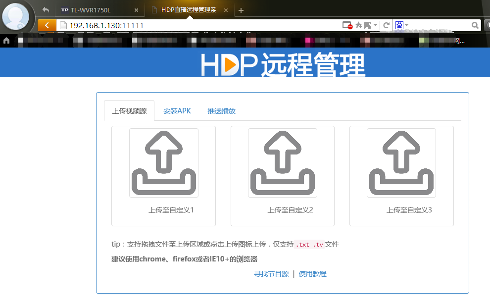
这样我们就可以在小米盒子上通过电视家、HDP看电信IPTV的直播信号了。
要在手机上观看，只要手机上也安装这两个软件即可。至于IPAD上，在应用商店里反复试用了多个直播软件后，终于找到一个可以批量导入自定义播放列表的直播软件，叫“小熊TV”，与HDP类似，也支持远程管理的方式：
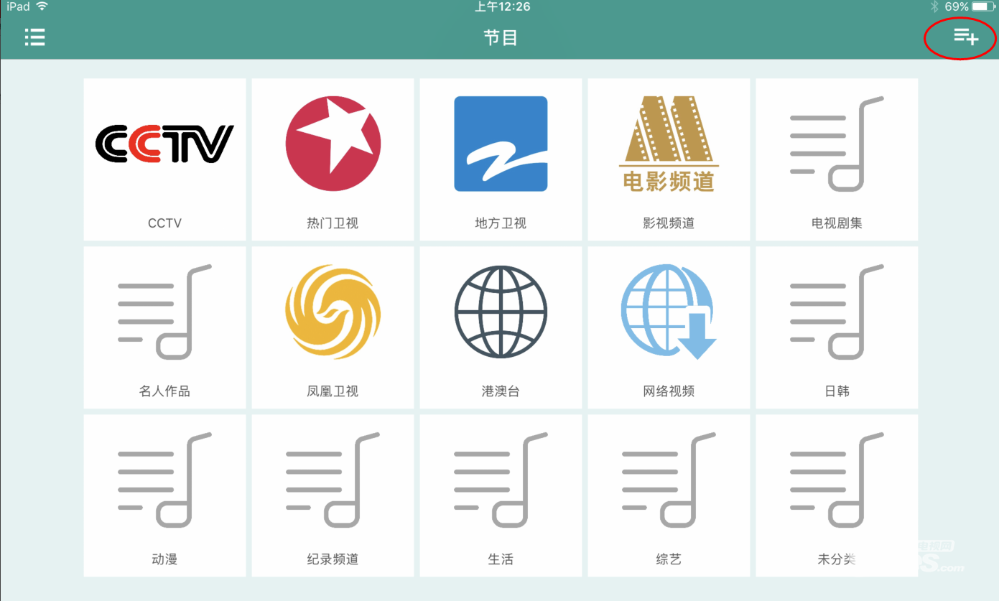
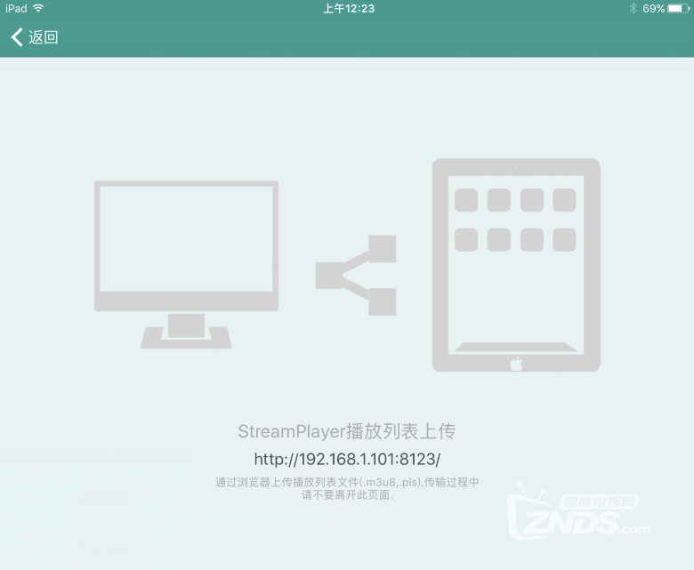
这是一张在手机上播放截图，可以看出IPTV给出的视频质量较那些播放软件自带的信源好了太多。
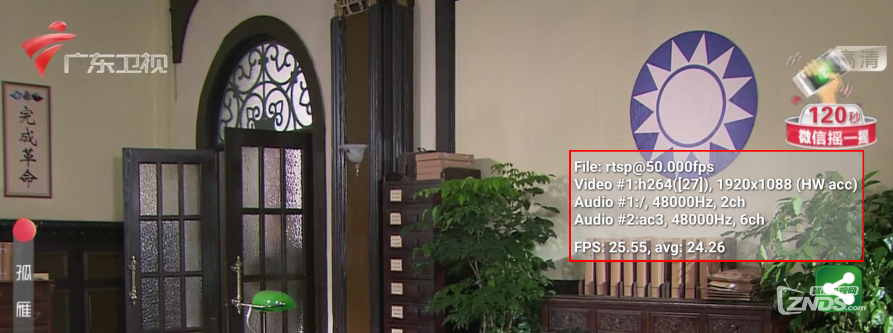

### =========【以下的文章为系统自动为您推荐】=========

- #### 小白的IPTV折腾教程(3)---双网融合、IPTV共享

  上两节地址 小白的IPTV折腾教程(1)---0元DIY抓包神器 小白的IPTV折腾教程（2）---使用0元抓包神器一次性简单抓湖北电信包  本节的目的： 1、互联网+iptv通道双网融合，解决弱电盒到电视机只有一根网线的问题 2、i……

  

- #### 简单的的IPTV 0成本抓包！

  昨天拿出了吃灰半年已久的华为悦盒，打算试试提取电信IPTV的直播，却发现半年过去了悦盒根本开不起来认证过不了，找了10000号，维修也弄不好，就给换了个创维e900-s。感觉越换越差，但抓包的兴致起了，便一鼓作气……

  

- #### 小白的IPTV折腾教程（2）---使用0元抓包神器一次性简单抓湖北电信包

  按我上一节制作神器的原理图（https://wp.gxnas.com/1182.html）接好我们的抓包神器，电脑的网卡获取ip的模式随便。IPTV盒子原来的认证原来是什么模式现在就还是什么模式。是pppoe认证的还是pppoe，是dhcp的还是用……

  

- #### 小白的IPTV折腾教程（1）---0元DIY抓包神器

  IPTV折腾的第一步就是抓包，可好多人上来就卡这步了。 据说有逼格的抓包使用带端口镜像的交换机就可以了。或者家里有远古集线器也行。有些路由器自带了端口镜像，貌似K2P刷高恪可以。还有少数机型的openwrt在交换……

  

- #### IPTV 与互联网融合

  前言 依赖 需要一个能够刷 OpenWrt 的路由器(需具有数据包镜像和 udpxy 功能/插件)用于抓包和后续的使用，因为其功耗较低且价格比较便宜 Newifi D2 拼多多 100 以下就可以拿下 能够正常播放节目的 IPTV 机顶盒，如……