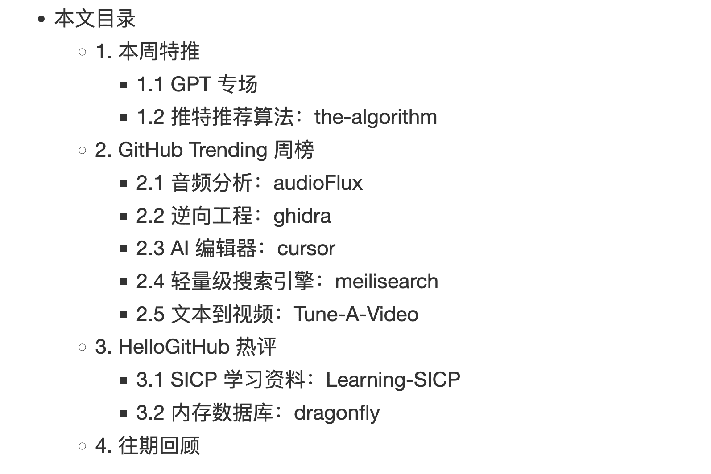
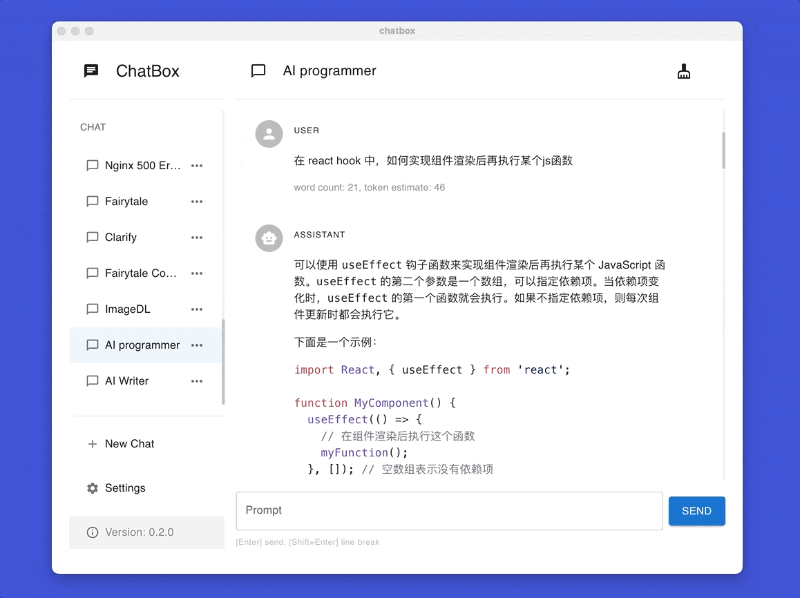
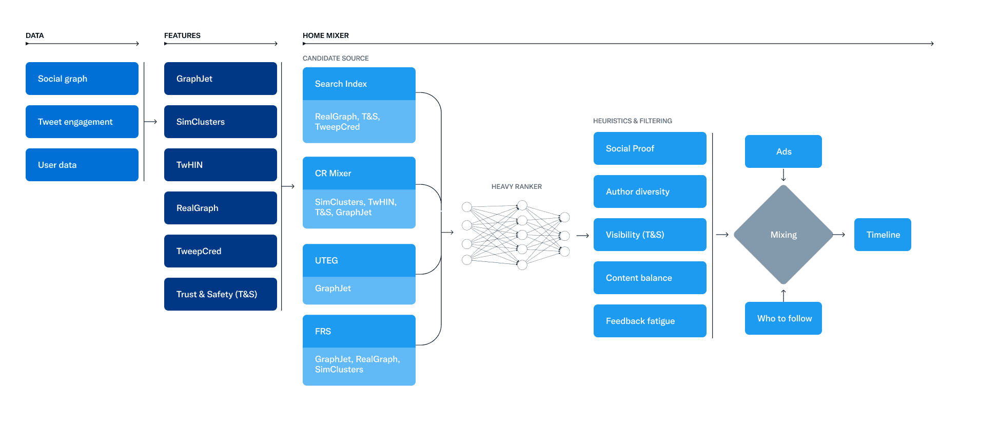
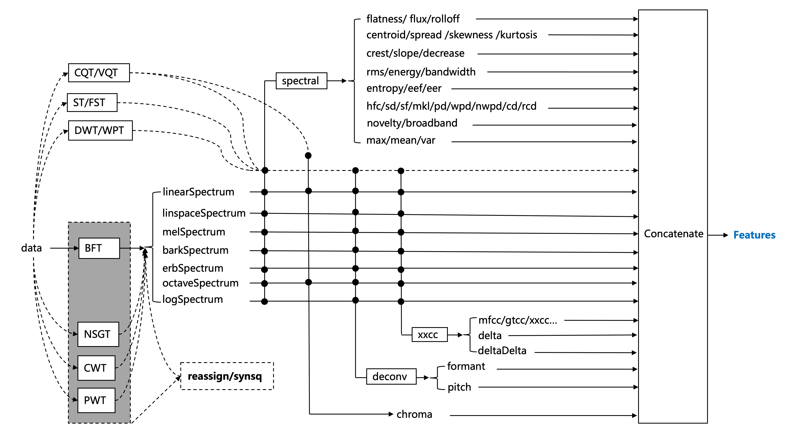
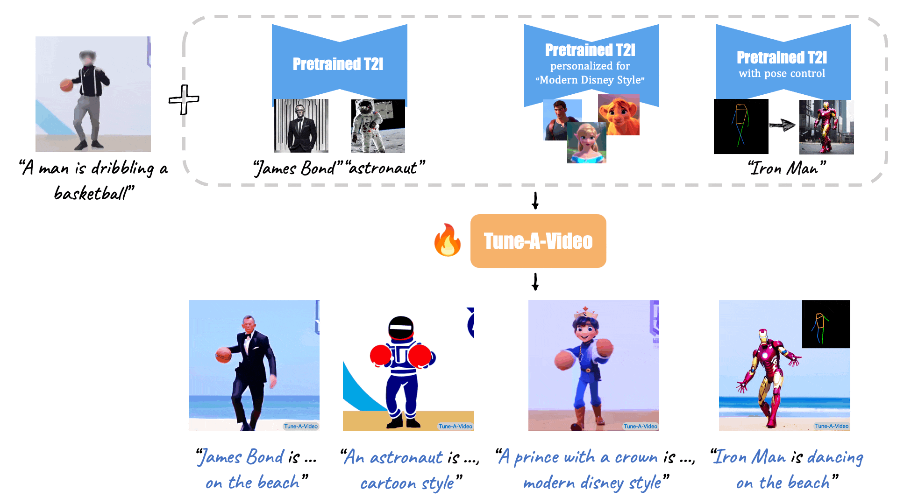
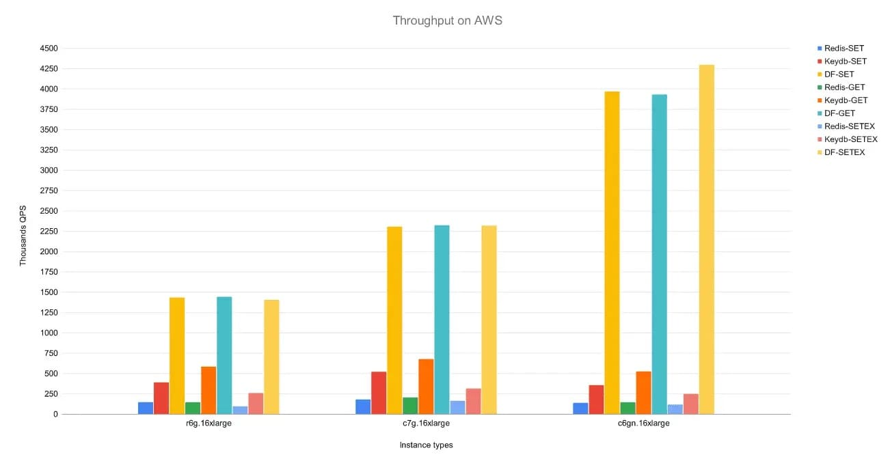

# 开源不到 48 小时获 35k star 的推荐算法「GitHub 热点速览」

本周的热点除了 GPT 各类衍生品之外，还多了一个被马斯克预告过、在愚人节开源出来的推特推荐算法，开源不到 2 天就有了 35k+ 的 star，有意思的是，除了推荐算法本身之外，阅读源码的工程师们甚至看到了员工对马斯克的特别关注（一段针对马斯克的代码），如果你对推荐有兴趣，不妨看看本周特推。

除了常规的 GPT 推荐之外，本周多了音频分析项目 audioFlux，老牌逆向工程工具 ghidra，比 Copilot 稍微更懂工程师的 cursor，轻量级搜索引擎 meilisearch 以及文本能生成视频的 Tune-A-Video。

选项标准：新发布 | 实用 | 有趣，根据项目 release 时间分类，发布时间不超过 14 day 的项目会标注 New，无该标志则说明项目 release 超过半月。由于本文篇幅有限，还有部分项目未能在本文展示，望周知

# 1. 本周特推

# 1.1 GPT 专场

在 GPT 热度消退之前，热点趋势的特推部分会增加一个模块来分享新的 GPT 应用。

# 飞书 x AI：feishu-chatgpt

**主语言：Golang**

New 一个飞书机器人，对接了 GPT-3.5、DALL-E 和 Whisper，具有语音对话、角色扮演、多话题讨论、图片创作、表格分析、文档导出等等功能。目前，feishu-chatgpt 支持飞书以及飞书国际版，支持 Serverless 云函数、本地环境、 Docker、 二进制安装包 等多种渠道部署。

> GitHub 地址→github.com/Leizhenpeng/feishu-chatgpt

# 开箱即用 ChatGPT：chatbox

**主语言：TypeScript**

New 开源的 ChatGPT 桌面应用，支持 Windows、macOS、Linux 等主流操作系统，下载安装包就能用，可谓是开箱即用。

> GitHub 地址→github.com/Bin-Huang/chatbox

# 1.2 推特推荐算法：the-algorithm

**主语言：Scala、Java**

New 愚人节开源的 Twitter For You（为你推荐）的推荐算法，作为海外主流的社交平台，想必推特的推荐算法对做社交推荐有一定的参考性。此外，你还可以了解到相关的推荐设计和代码实现。官方博客详细介绍了推荐算法。

> GitHub 地址→github.com/twitter/the-algorithm

# 2. GitHub Trending 周榜

# 2.1 音频分析：audioFlux

**本周 star 增长数：400+，主语言：C、Python**

可在音频和音乐中提取特征的库，audioFlux 基于数据流设计，算法对各个算法模块进行解耦，能高效地提取多个维度的特征。

> GitHub 地址→github.com/libAudioFlux/audioFlux

# 2.2 逆向工程：ghidra

**本周 star 增长数：700+，主语言：Java**

ghidra 是美国国家安全局 (NSA) 开源的一个软件逆向工程（SRE）框架，包括一套功能齐全的高端软件分析工具，使用户能够在各种平台上分析编译后的代码，支持 Windows、macOS 和 Linux。它支持的功能包括反汇编、汇编、反编译、绘图和脚本，以及数百个其他功能，它也支持各种处理器指令集和可执行格式，可以在用户交互模式和自动模式下运行，你还可以用公开的 API 开发自己的 ghidra 插件和脚本。

> GitHub 地址→github.com/NationalSecurityAgency/ghidra

# 2.3 AI 编辑器：cursor

**本周 star 增长数：8,250+，主语言：TypeScript**

New 一个智能编辑器，可以帮你做一点点事情：

- 写代码：比 Copilot 更聪明，能写 10-100 行代码；
- Diff：根据要求编辑代码块，可仅查看建议变更；
- 类 ChatGPT 交互；
- 其他：修 bug、光标评论等等；

> GitHub 地址→github.com/getcursor/cursor

# 2.4 轻量级搜索引擎：meilisearch

**本周 star 增长数：400+，主语言：Rust**

一款轻量级的搜索引擎，可应用在你的应用程序、网站、workflow 上。

> GitHub 地址→github.com/meilisearch/meilisearch

# 2.5 文本到视频：Tune-A-Video

**本周 star 增长数：1,050+，主语言：Python**

文本到视频生成的图像扩散模型的一次调优，简单来说，现在你也可以输入一段文字来获得一段视频了。

> GitHub 地址→github.com/showlab/Tune-A-Video

# 3. HelloGitHub 热评

在这个章节，我们将会分享下本周 HelloGitHub 网站上的热评项目，HG 开源项目评价体系刚上线不久，期待你的评价 :D

# 3.1 SICP 学习资料：Learning-SICP

**主语言：Ruby**

《计算机程序的构造和解释》的学习资料集合，收录 SICP 系列的公开课视频和中文字幕，以及包括原书、新手教程、环境搭建、拓展习题等相关资料。

# 3.2 内存数据库：dragonfly

**主语言：C++**

一款为取代 Redis 而生的内存数据库，它与当下最流行的两款内存数据库 Redis 和 Memcached 的 API 完全兼容，所以无需修改代码即可完成迁移。性能上更是爆炸，官方表示单实例可支持数百万量级的 QPS，而且吞吐量是 Redis 的 25 倍，并可以应对 TB 级别的内存数据集。

\- END -