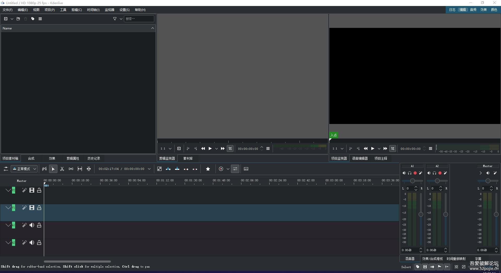
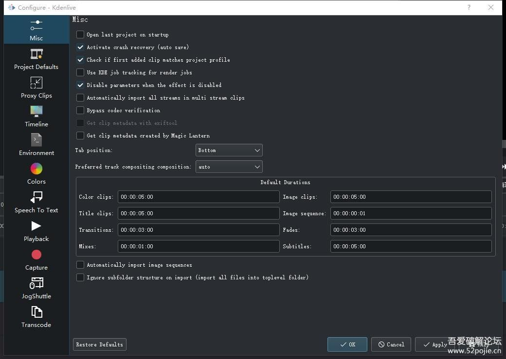
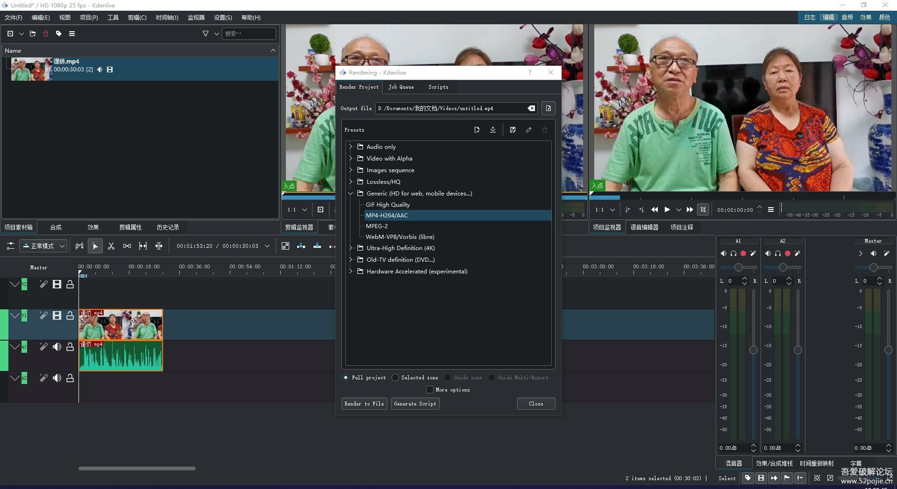

# 开源免费视频编辑器Kdenlive22.08.3

**简介：**
Kdenlive 是一款自由开源的免费视频剪辑软件，项目发起于 2003 年。Kdenlive 基于 Qt和 KDE 程序库框架构建，大部分的视频处理功能则是通过 MLT 媒体程序框架实现，而 MLT 的功能则是基于 FFmpeg、frei0r、movit、ladspa、sox 等自由开源软件项目实现。Kdenlive 的设计思路是尽可能满足大多数用户的需要，从基本视频剪辑到专业剪辑都能胜任。kdenlive是linux下最好用的免费开源视频编辑软件。软件支持语言很多，不过特效部分汉化不完全或者说是大部分都没汉化，21版本在B站的部分视频上貌似汉化比较彻底，但我没找到那个版本。
**特点：**
1、支持几乎所有音视频格式：通过功能强大的 FFmpeg程序库，Kdenlive 能够使用几乎每一种音频和视频格式。您无需对剪辑进行事先转码；
2、可定制的界面和快捷键；
3、Titler字幕制作工具&#8203;；
4、多种效果和转场；
5、音频和视频示波器；
6、代{过}{滤}理剪辑：Kdenlive 可以自动创建来源剪辑的低分辨率副本来在配置较低的计算机上进行流畅编辑，然后输出为完全分辨率的视频；
7、几分钟会自动保存，一共保持2分备份；
8、从软件界面直接下载编码方案、转场和字幕模板；
9、时间轴预览；
10、通过关键帧调整效果；
11、具有弹性的主题引擎，支持亮色和暗色主题；
12、版本更新很快，版本号由三部分组成，第一部分是年号，第二部分是月份，第三部分是第几个版本。一般正式版每月一个小版本，4个月一个中版本，每年一个大版本。测试版基本上工作日每天一个版本（偶尔推出失败会跳过），不过测试版版本号怎么命名还真没搞清楚，有可能是1302是现在已经推出了1302个测试版？

**【评价】**相比openshot来说，界面要复杂点，稳定性好很多，主要问题是中文翻译不全，但确实很好用的一个比较专业的视频编辑软件，大家可以对比下，个人感觉openshot有点像剪映，这个相比更接近pr。导出视频在这个软件里面叫“渲染”，不然可能你半天找不到怎么导出来。
很多人问这个和pr相比怎么样，怎么说呢，两者都是非线编软件，pr比这个更专业一些，而且pr主要有一整套的工具，比如修图有ps，转码有ame，声音编辑有AU，特效有ae······，还有各种三方插件，所以要做复杂的视频特效肯定是不如pr的，但胜在简单实用，而且功能也并不逊色pr太多，不过特效那些需要自己去组合，不太适合小白做特效用，但用来剪辑视频比pr好使，自带批量渲染导出（可以定制自己需要导出的视频的一切参数，相比ame更灵活，可以在相同画质方面视频更小，这一点和小日本差不多，不过相比小日本不管是功能还是其他方面都强悍太多了），视频编辑前可以先转成无损再编辑，这样可以使部分视频画质比原视频更好。总之两者我觉得针对不同领域，剪辑视频用这个更好使，做特效用pr全家桶更好使，调色用达芬奇更佳，主要看你自己的用途。

【官网】https://kdenlive.org/zh
【官网下载页面】https://kdenlive.org/zh/download-zh/
【windows绿色版】[https://download.kde.org/stable/ ... 08.3_standalone.exe](https://download.kde.org/stable/kdenlive/22.08/windows/kdenlive-22.08.3_standalone.exe)
【windows安装版】[https://download.kde.org/stable/ ... denlive-22.08.3.exe](https://download.kde.org/stable/kdenlive/22.08/windows/kdenlive-22.08.3.exe)
【windows每日测试版】[https://binary-factory.kde.org/j ... sfulBuild/artifact/](https://binary-factory.kde.org/job/Kdenlive_Nightly_mingw64/lastSuccessfulBuild/artifact/)
【使用手册】https://docs.kdenlive.org/zh_CN/

【学习视频】[https://space.bilibili.com/32722 ... eo?keyword=kdenlive](https://space.bilibili.com/327222212/search/video?keyword=kdenlive)
（kdenlive在国内的视频教程较少，大多都是一个简单介绍ui的视频，没啥用，这个站主从18年到21年总共做了21期视频，介绍算是比较全面的了，大部分常用功能都有提到）