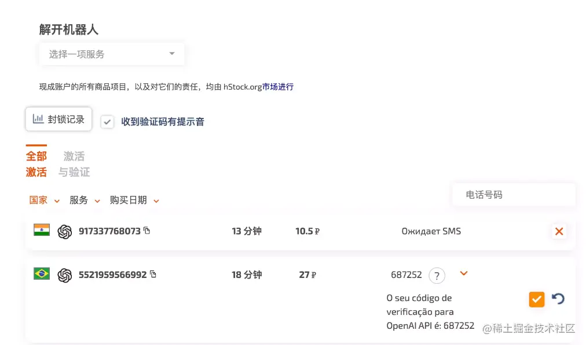

# 超详细的ChatGPT注册教程来了

# 一、 背景

最近一周，大家都在讨论ChatGPT，一些主流的技术社区更是将ChatGPT吹的神乎其技，那ChatGPT是什么呢？又能给我们带来哪些变化呢？。带着这些问题，我打算先注册并使用 ChatGPT，供想要体验 ChatGPT 的小伙伴们参考。

首先，我们来了解下什么是ChatGPT，以及它的诞生背景。根据维基百科的官方解释：ChatGPT是由OpenAI开发的一个人工智能聊天机器人程序，于2022年11月30日推出。该程序使用基于GPT-3.5架构的大型语言模型并通过强化学习进行训练。ChatGPT 使用基于人类反馈的强化学习进行训练，这种方法通过人类干预以增强机器学习的效果，从而获得更为逼真的结果。其使用基于GPT-3.5架构的语言模型。在训练过程中，人类训练师扮演着用户与人工智能助手的角色。模型在Microsoft Azure的超级计算机上训练，并通过近端策略优化算法（proximal policy optimization）进行微调。这种策略优化算法比信任域策略优化（trust region policy optimization）算法更为高效。

# 二、注册 ChatGPT

要注册使用 ChatGPT，我们需要准备以下内容：

- 能够访问Google的全局代理，推荐美国节点；
- 一个邮箱用于注册，如Gmail, Outlook ；
- 一个国外手机号，如果没有可以使用sms-activate.org；

## 2.1 注册短信平台

由于ChatGPT的注册需要用到国外的手机号接收验证码，如果没有的话可以开发sms-activate.org网站注册一个账号。

由于每次接收验证码都要收取10.5卢布，大约1.2 人民币，如果你的账号没有钱，可以点击右上角余额进行充值。sms-activate支持的充值方式又很多，我们滑到支付宝选择支付宝充值。

## 2.2 注册OpenAI

回到主界面，然后在搜索框中输入OpenAI，如下图所示。

 

然后，点击小黄车即可购买，购买成功后，我们需要将手机号复制出来供后面使用。

有了手机号之后，我们就可以注册OpenAI账号了。打开[beta.openai.com/signup](https://link.juejin.cn?target=https%3A%2F%2Fbeta.openai.com%2Fsignup)链接，然后开始注册。

然后，我们选择选择刚刚注册的国家为印度，将刚刚注册的手机号复制过去，记得去掉国家号，此处是91。最近评论区有留言说选择印度可能会失败了，建议换成印尼🇮🇩/巴西🇧🇷/泰国🇹🇭试试。

 

回到之前获取手机号的界面，会出现短信，复制短信验证码即可。之后你就可以愉快的和ChatGPT聊天啦，快去试试吧。

# 三、体验ChatGPT

我们打开[beta.openai.com/overview](https://link.juejin.cn?target=https%3A%2F%2Fbeta.openai.com%2Foverview)官网链接。然后在顶部选择某个话题，点击的【 Try it】按钮，就可以开始与 ChatGPT 聊天啦！  

简单的体验了一下ChatGPT，发现还是挺好玩的，大家不妨试一试。并且随着ChatGPT的大热，最近一款名为 Glow 的 AI 聊天应用上线 App store，被称为 ChatGPT 的国产平替。据介绍，Glow 基于 AIGC 技术打造，希望给那些无聊、焦虑或者需要被倾听的人，提供一个随时有认真回复的智能体。

作者：xiangzhihong
链接：https://juejin.cn/post/7175917144025071673
来源：稀土掘金
著作权归作者所有。商业转载请联系作者获得授权，非商业转载请注明出处。